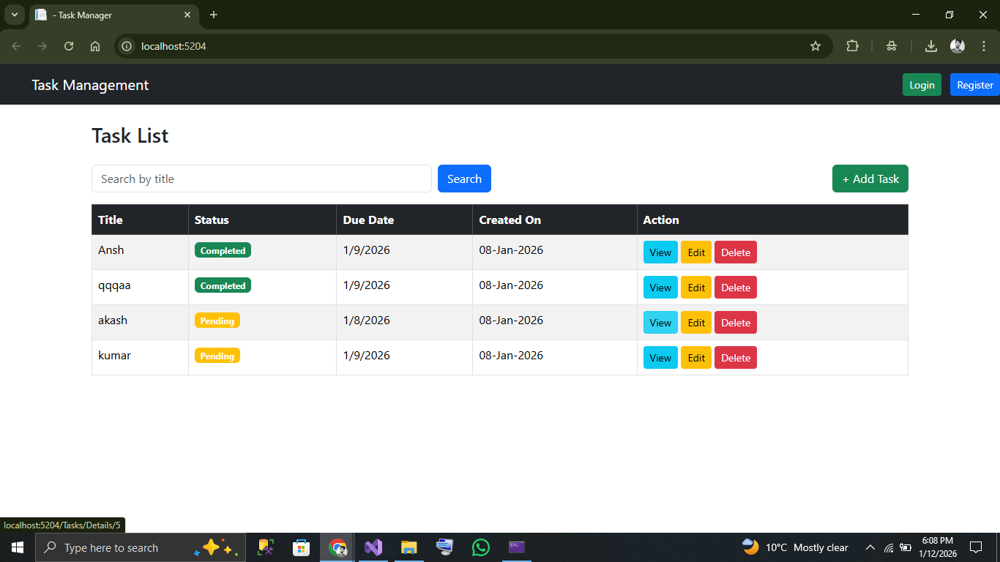
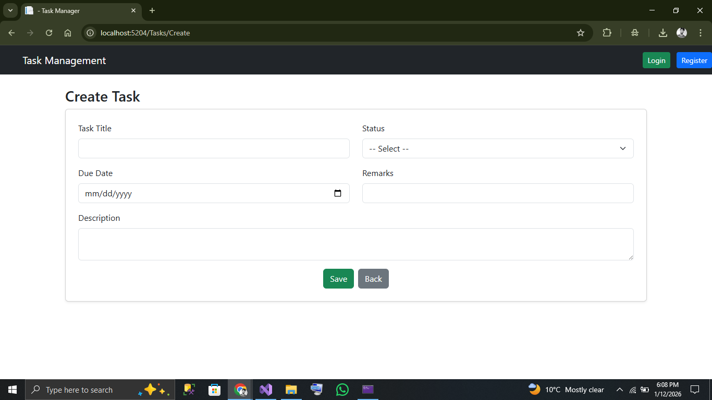
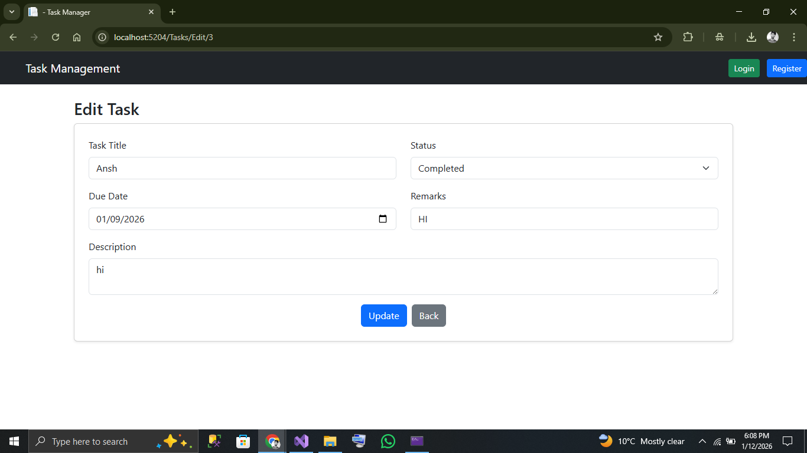
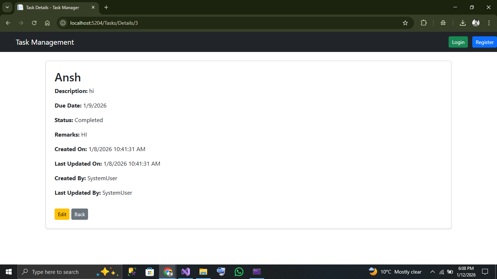
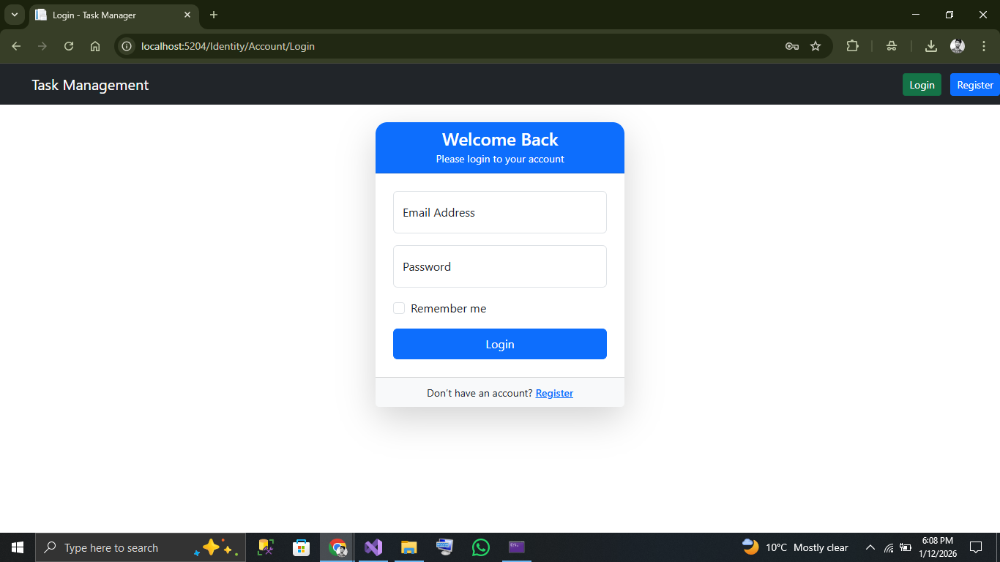
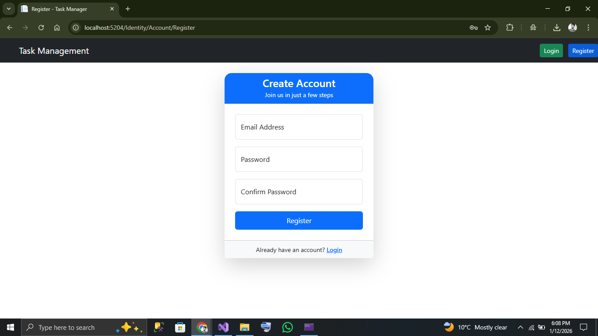
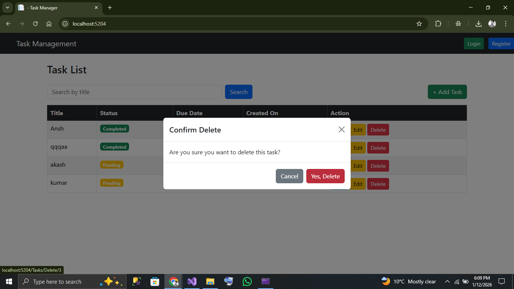

# TaskManagement
# Task Management System

## 2.1.3.1 Overview of What Is Being Built

This project is a **Task Management System** built using **ASP.NET Core MVC** and **Entity Framework Core**. The application allows users to perform full **CRUD operations (Create, Read, Update, Delete)** on tasks along with search functionality. It demonstrates backend development, database design, MVC architecture, and proper documentation practices as required by the assignment.

## 📌 Key Features

### ✅ Task List & Search
- View all tasks in a tabular format
- Search tasks by title
- 

### ➕ Create Task
- Add new tasks with **title, status, due date, remarks, and description**
-   

### ✏️ Edit Task
- Update task details and status easily
-  

### 🔍 Task Details View
- View complete task information including created/updated metadata
-    

### 🔐 Authentication (Login & Register)
- Secure user authentication using **ASP.NET Core Identity**
  - Login Page
  -  
  - Register Page
  -  

### 🗑️ Delete Confirmation
- Modal popup confirmation before deleting a task
-   

### 🧱 Architecture & Design
- Server-side rendered MVC views
- Clean separation of concerns using **MVC pattern**
- Session-based logout handling


---

## 2.1.3.2 Database Design

### 2.1.3.2.1 ER Diagram

```
+---------------------------+
|        AspNetUsers        |
+---------------------------+
| Id (PK)                   |
| UserName                  |
| Email                     |
| PasswordHash              |
| ...                       |
+-------------+-------------+
              |
              | 1
              |
              | *
+-------------v-------------+
|         TaskItem           |
+---------------------------+
| Id (PK)                   |
| TaskTitle                 |
| TaskDescription           |
| TaskDueDate               |
| TaskStatus                |
| TaskRemarks               |
| CreatedOn                 |
| LastUpdatedOn             |
| CreatedBy (FK → UserName) |
| LastUpdatedBy             |
+---------------------------+

```


This application currently uses a single core entity (`TaskItem`) to manage task-related information.

---

### 2.1.3.2.2 Data Dictionary

| Column Name     | Data Type     | Description                                 |
| --------------- | ------------- | ------------------------------------------- |
| Id              | int (PK)      | Unique identifier for the task              |
| TaskTitle       | nvarchar(100) | Title of the task (Required)                |
| TaskDescription | nvarchar(500) | Detailed description of the task (Required) |
| TaskDueDate     | datetime      | Due date for the task                       |
| TaskStatus      | nvarchar(50)  | Status (Pending, Completed, etc.)           |
| TaskRemarks     | nvarchar(500) | Optional additional remarks                 |
| CreatedOn       | datetime      | Record creation timestamp                   |
| LastUpdatedOn   | datetime      | Last modification timestamp                 |
| CreatedBy       | nvarchar(256) | Username who created the record             |
| LastUpdatedBy   | nvarchar(256) | Username who last modified the record       |

---

### 2.1.3.2.3 Documentation of Indexes Used

* **Primary Key Index** on `Id`
* Optional non-clustered index can be added on:

  * `TaskTitle` (to optimize search performance)

Example:

```sql
CREATE NONCLUSTERED INDEX IX_Task_TaskTitle ON Tasks(TaskTitle);
```

---

### 2.1.3.2.4 Code First or DB First Approach

✅ **Code First Approach Used**

**Reason:**

* Faster development and iteration
* Strongly typed domain models
* Easier version control of schema changes using migrations
* Ideal for small to medium-sized applications

Entity Framework Core automatically generates the database schema based on model classes.

---

## 2.1.3.3 Application Structure

### 2.1.3.3.1 SPA with API Binding

❌ Not used

### 2.1.3.3.2 Standard MVC Server-Side Rendering

✅ Used

The application follows **ASP.NET Core MVC**:

* **Models**: TaskItem entity
* **Views**: Razor (.cshtml) views
* **Controllers**: TasksController handling all HTTP requests

This approach was chosen for simplicity, maintainability, and suitability for the assignment scope.

---

## 2.1.3.4 Frontend Structure

### 2.1.3.4.1 Frontend Technology Used

* Razor Views (CSHTML)
* HTML5, CSS3
* Bootstrap (for responsive UI)

**Why:**

* Tight integration with ASP.NET Core MVC
* Faster development without separate frontend framework
* Server-side rendering improves SEO and simplicity

### 2.1.3.4.2 Web or Mobile Application

✅ **Web Application**

The application is web-based and accessible via browser.

---

## 2.1.3.5 Build and Install

### 2.1.3.5.1 Environment Details & Dependencies

* **.NET SDK**: .NET 6 / .NET 7+
* **IDE**: Visual Studio 2022 / VS Code
* **Database**: SQL Server / LocalDB
* **ORM**: Entity Framework Core
* **Packages**:

  * Microsoft.EntityFrameworkCore
  * Microsoft.EntityFrameworkCore.SqlServer
  * Microsoft.EntityFrameworkCore.Tools

---

### 2.1.3.5.2 How to Build the Project

```bash
dotnet restore
dotnet build
```

Or using Visual Studio:

* Open solution file (.sln)
* Click **Build → Build Solution**

---

### 2.1.3.5.3 How to Run the Project

```bash
dotnet ef database update
dotnet run
```

Or using Visual Studio:

* Set project as Startup Project
* Press **F5** or **Ctrl + F5**

Application will run at:

```
https://localhost:5001
```

---

## 2.1.3.6 General Documentation

### Domain Model (TaskItem)

The `TaskItem` model uses **Data Annotations** for validation and includes **audit fields** for tracking creation and modification details.

Key highlights:

* Validation using `[Required]` and `[StringLength]`
* Audit fields: `CreatedOn`, `LastUpdatedOn`, `CreatedBy`, `LastUpdatedBy`
* `CreatedOn` is explicitly controlled in code using `DatabaseGeneratedOption.None`

### DbContext Design (ApplicationDbContext)

The `ApplicationDbContext` inherits from `IdentityDbContext<IdentityUser>`, enabling seamless **ASP.NET Core Identity** integration.

Audit handling is implemented by:

* Overriding `SaveChanges()` and `SaveChangesAsync()`
* Automatically populating audit fields using `IHttpContextAccessor`
* Capturing the logged-in username or defaulting to `System`

This approach ensures:

* Centralized audit logic
* No duplication of audit code in controllers
* Consistent data integrity across all database operations

---

### Folder Structure

```
TaskManagement/
│── Controllers/
│   └── TasksController.cs
│── Models/
│   └── TaskItem.cs
│── Data/
│   └── ApplicationDbContext.cs
│── Views/
│   └── Tasks/
│── wwwroot/
│── Program.cs
│── appsettings.json
```

### Key Controller Responsibilities

* `Index()` – List & search tasks
* `Details()` – View task details
* `Create()` – Add new task
* `Edit()` – Update existing task
* `Delete()` – Remove task
* `Logout()` – Clear session

---
# 2.2 Assignment Objectives Coverage

The **Task Management System** successfully fulfills all required assignment objectives as outlined below:

* ✔ **Backend Technologies** – ASP.NET Core MVC, Entity Framework Core
* ✔ **Frontend Technologies** – Razor Views, Bootstrap
* ✔ **Database Systems** – Microsoft SQL Server with Entity Framework Core
* ✔ **Problem Solving** – CRUD operations, search functionality, and data validation
* ✔ **Documentation** – Markdown-based GitHub README documentation
* ✔ **Planning & Execution** – Structured MVC architectural design

---

## 2.2.2 Areas

### 2.2.2.1 Database Management System

The Task Management System uses a **Relational Database Management System (RDBMS)** to store and manage task-related data along with user authentication information.

#### Database Features

* Ensures data integrity using **primary and foreign keys**
* Supports efficient querying through **indexes**
* Provides secure storage of user credentials using **ASP.NET Core Identity**

#### Responsibilities of the Database Layer

* Persist task records
* Maintain user authentication and authorization data
* Store audit fields such as `CreatedOn`, `CreatedBy`, `UpdatedOn`, etc.

---

### 2.2.2.2 Backend Modules (MVC / API Based)

The backend is developed using **ASP.NET Core MVC**, following the **Model–View–Controller (MVC)** architectural pattern.

#### Backend Responsibilities

* Handle HTTP requests and responses
* Implement application business logic
* Perform CRUD operations using **Entity Framework Core**
* Manage authentication and authorization

#### Key Backend Components

* **Controllers** – Handle user requests (e.g., `TasksController`)
* **Models** – Represent domain entities (e.g., `TaskItem`)
* **DbContext** – Manages database interactions (`ApplicationDbContext`)
* **ASP.NET Core Identity** – Manages user registration, login, and sessions

---

### 2.2.2.3 Frontend Module – MVC / MPA Based

The application follows a **Traditional MVC / Multi-Page Application (MPA)** approach.

#### Frontend Characteristics

* Server-side rendered **Razor Views**
* Each user action results in a request–response cycle
* Clear separation of UI and backend logic

#### Reason for Choosing MVC / MPA

* Simpler architecture suitable for the assignment scope
* No requirement for a separate frontend framework
* Seamless integration with **ASP.NET Core Identity**

---

## 2.2.3 Choice of Technologies

### 2.2.3.1 Programming Language

* ✔ **C#**

**Reason:**

* Native language for ASP.NET Core
* Strongly typed and object-oriented
* Excellent support for MVC, ORM, and Identity

> Other languages allowed by the assignment (Java, Python, PHP) were not used in this project.

---

### 2.2.3.2 RDBMS

* ✔ **Microsoft SQL Server**

**Reason:**

* Seamless integration with **Entity Framework Core**
* Reliable, scalable, and enterprise-ready
* Fully supported by **ASP.NET Core Identity** schema

> Other databases allowed (PostgreSQL, MySQL, Oracle) were not used.

---

### 2.2.3.3 Frontend Technologies

#### Web-Based Technologies Used

* Razor Views (`.cshtml`)
* HTML5
* CSS3
* Bootstrap 5

**Reason:**

* Rapid UI development
* Responsive and mobile-friendly design
* Tight integration with ASP.NET Core MVC


## Conclusion

This project fulfills all requirements mentioned in the assignment document, including working demo, public GitHub hosting, proper documentation, database design explanation, and clear architectural decisions. The solution is scalable, maintainable, and ready for evaluation.  
